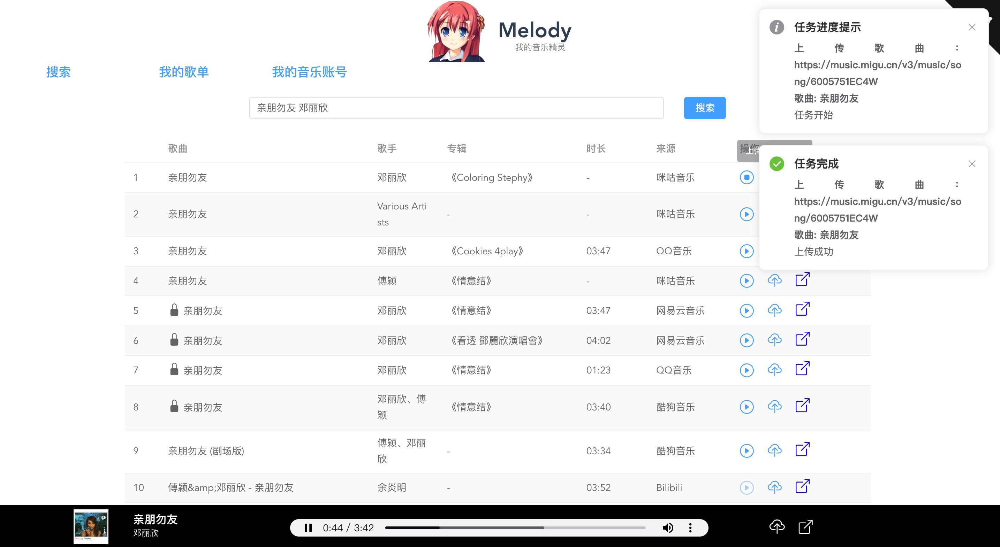
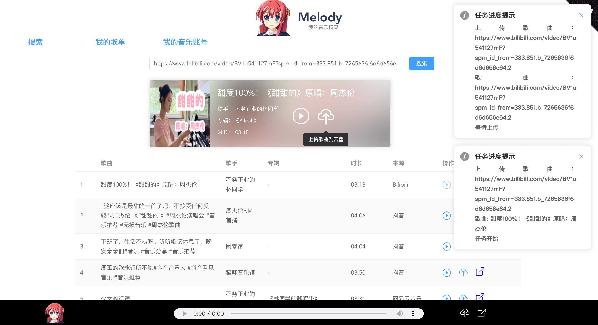
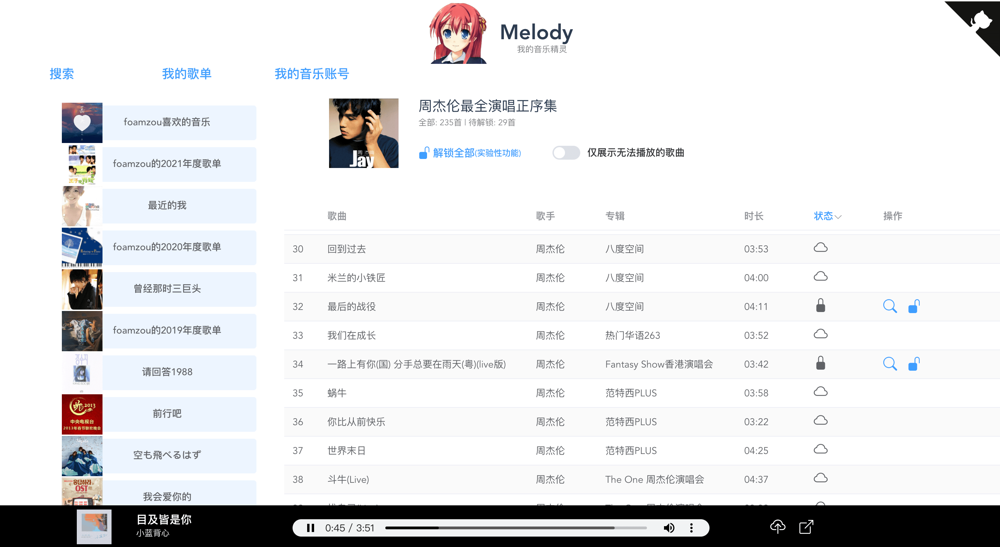
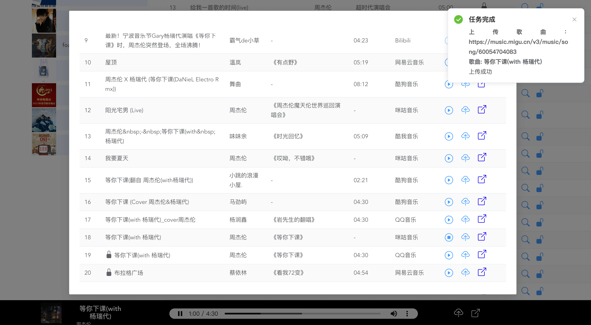
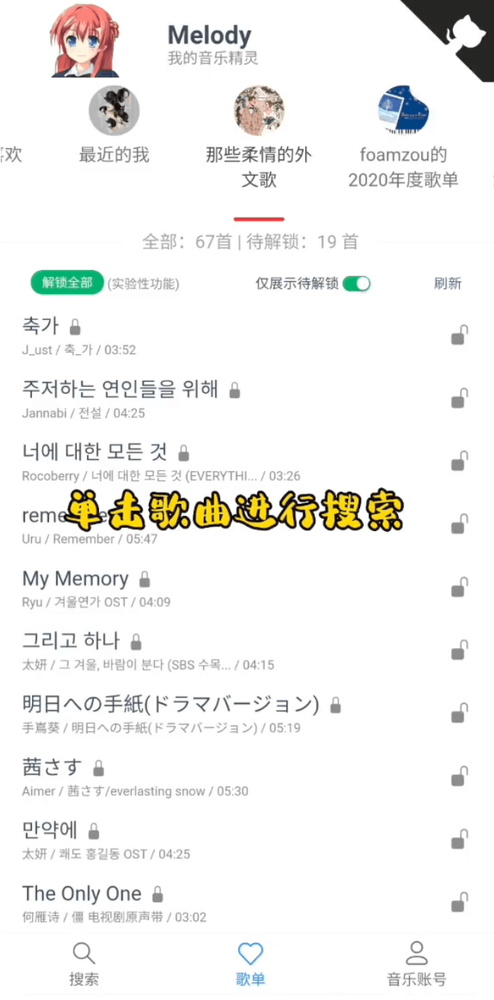
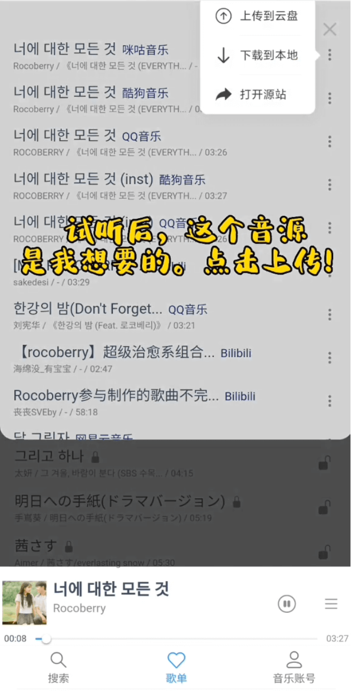

# Melody

## 项目介绍

</img>

大家好，我叫 Melody，你的音乐精灵，旨在帮助你更好地管理音乐。目前的主要能力是帮助你将喜欢的歌曲或者音频上传到音乐平台的云盘。

## 免责声明
- 本项目所搜索的歌曲均来源于音乐平台的免费公开资源。请确保在使用本项目时遵守相关音乐平台的服务条款和版权规定。
- 本项目仅供技术学习和交流使用，使用者仅限于个人学习，不得用于任何商业目的。使用者应自行承担因使用本项目而可能产生的法律责任。

为了避免不必要的纠纷和账号安全问题，本项目不会以任何形式提供在线 demo 服务


## Feature

- 支持在各大音乐和视频网站检索歌曲。目前支持 咪咕、网易云、QQ 音乐、酷狗、bilibili、抖音等站点。详情可以在我的 [media-get](https://github.com/foamzou/media-get#%E6%94%AF%E6%8C%81%E7%9A%84%E7%BD%91%E7%AB%99) 项目中查看
- 支持一键下载到本地，一键上传到云盘
- 用链接搜索歌曲（例如使用 b站或抖音的视频链接进行搜索，可以将对应的音频自动上传到音乐云盘）
- 一键“解锁”无法播放的歌曲（一键检测变灰的歌曲，自动从公共资源搜索最佳资源，自动上传到云盘，自动匹配歌曲信息。代替繁琐的人工操作，实现可播放）（实验性功能，目前仅支持网易云）
- PC 端、移动端适配良好（支持 PWA）
- 部署简单，支持 docker

## 安装和启动

### 方式一：Docker 安装

1. 在你的宿主机创建一个目录，例如： `~/melody-profile`
2. 创建镜像，有两种方式选择(注意修改下面的宿主机目录为你实际的)：
   - 从 hub.docker.com 拉取
     ```
     docker run -d -p 5566:5566  -v ~/melody-profile:/app/backend/.profile foamzou/melody:latest
     ```
   - 从代码编译镜像(若你的 docker 不支持 DOCKER_BUILDKIT，则去掉)
     ```
     DOCKER_BUILDKIT=1 docker build -t melody .
     docker run -d -p 5566:5566  -v ~/melody-profile:/app/backend/.profile melody
     ```
3. 后续更新（以从 hub.docker.com 更新为例）
   ```
   docker pull docker.io/foamzou/melody:latest
   docker kill <CONTAINER ID>
   docker run -d -p 5566:5566  -v ~/melody-profile:/app/backend/.profile foamzou/melody:latest
   ```

### 方式二：源码安装

1. 依赖

   确保以下两个依赖是安装好的

   1. node.js ([官网下载](https://nodejs.org/zh-cn/download/))
   2. FFmpeg ([windows 安装介绍](https://zhuanlan.zhihu.com/p/400952501))

2. 下载源码、初始化服务、运行服务

   ```
   git clone https://github.com/foamzou/melody.git
   cd melody && npm run init && npm run app
   ```

3. 若后面代码有更新，下次执行该命令即可更新
   ```
   npm run update && npm run app
   ```

### 方式三：通过第三方部署
<details>
<summary>通过宝塔面板一键部署</summary>
   
#### 前提

* 仅适用于宝塔面板 9.2.0 及以上版本
* 安装宝塔面板，前往[宝塔面板](https://www.bt.cn/new/download.html)官网，选择正式版的脚本下载安装

#### 部署

1. 登录宝塔面板，在左侧菜单栏中点击 `Docker`
2. 首次会提示安装`Docker`和`Docker Compose`服务，点击立即安装，若已安装请忽略。
3. 安装完成后在`Docker-应用商店-实用工具`中找到 `Melody`，点击`安装`，也可以在搜索框直接搜索`linux`。
4. 设置域名等基本信息，点击`确定`
* 说明：
  * 名称：应用名称，默认`melody_随机字符`
  * 版本选择：默认`latest`
  * 域名：如您需要通过域名访问，请在此处填写您的域名
  * 允许外部访问：如您需通过`IP+Port`直接访问，请勾选，如您已经设置了域名，请不要勾选此处
  * 端口：默认`5568`，可自行修改
  * CPU 限制：0 为不限制，根据实际需要设置
  * 内存限制：0 为不限制，根据实际需要设置
5. 提交后面板会自动进行应用初始化，大概需要`1-3`分钟，初始化完成后即可访问。
</details>

### 配置你的账号（可选）

默认的 melody key 为： `melody`，若你的服务部署在私有网络，则可以不用修改（网易云账号、密码可以在 web 页面设置）。

若需要修改或添加新账号，则编辑 `backend/.profile/accounts.json` （安装方式为 docker 的则为：`你的宿主机目录/accounts.json` ） 。

1. 该 JSON 中的 key 是 `Melody Key`，是你在网页访问该服务的唯一凭证
2. 网易云账号信息： `account` 和 `password` 可以后续在网页修改
3. 该 JSON 是个数组，支持配置多个账号

Q: 更新了 accounts.json 如何生效？

A: 两种方式。1: 重启服务。2: 网页端 `我的音乐账号` tab 下，随便修改点账号，密码，然后点击 `更新账号密码`，这样会从 accounts.json 更新信息到内存（我后面优化下这块）

### 浏览器访问

最后，在浏览器访问 http://127.0.0.1:5566 就可以使用啦~

## 功能介绍

### 关键词搜索歌曲

如果试听后是你想要的，点击上传按钮会将该歌曲上传到你的网易云音乐云盘
</img>

### 链接搜索

有时候我们在 b 站 听到好听的歌，也可以上传到云盘
</img>

### 一键解锁歌单

点击 `解锁全部`（实验性功能） 后，服务会自动匹配每首歌，并把歌曲上传到云盘，最后做个 match，以保证你还能看到歌词、评论
</img>

### 手动搜索匹配

当某首歌自动解锁失败后，还可以手动点击搜索按钮，找到符合的歌曲后，手动点击上传按钮
</img>

### 移动端适配
<div>
   </img>
   </img>
</div>
<div style="margin-top:30px;">
   </img>
   </img>
</div>

## Roadmap

计划在后面支持以下功能

- [x] 页面适配移动端
- [ ] 浏览器油猴脚本
- [ ] 云盘歌曲 match 手动纠错
- [ ] 支持播放列表
- [x] 支持播放云盘的歌曲
- [x] 支持 docker 部署
- [ ] 支持 youtube-dl,you-dl 等工具作为输入源
- [ ] 支持 酷狗、qq 音乐等音乐平台的云盘作为输出
- [ ] 偏好设置
- [ ] 版本更新提示

## Q & A
1. Q：移动端版本，为什么点击下载歌曲，会跳新的页面？

   A：有的浏览器不支持嗅探的，会有这个问题。因为外部资源文件都不允许跨域，无法用常规下载方式 save as。考虑后续 hack
2. Q：移动端版本，为什么在数据网络无法播放歌曲？

   A：发现某些网络下，没有触发 `canplaythrough` 事件，wifi 环境下一般是没有问题的。
3. Q：为什么移动端 PWA，点击跳转到其他页面时，无法返回到原来页面？

   A：PWA 在移动端不支持使用外部浏览器打开外链，只能在应用内打开，因此会有各种奇怪问题。此时，只能先杀死应用。

4. Q：为什么我部署的服务，PWA 始终出不了？

   A：PWA 要求服务必须是 HTTPS。

5. Q: 为什么更新 media-get 组件后，搜索报错
   
   A: 目前存在 bug，更新完 media-get 组件之后，请务必重启 docker 容器或服务，否则将无法继续使用

## Change log
见 [Release](https://github.com/foamzou/melody/releases)

## 致谢

- [NeteaseCloudMusicApi](https://github.com/Binaryify/NeteaseCloudMusicApi) 的网易云 API
- [MakeGirlsMoe](https://make.girls.moe/) 生成的 Melody 虚拟形象图片
- [Media Get](https://github.com/foamzou/media-get) 我的开源项目
